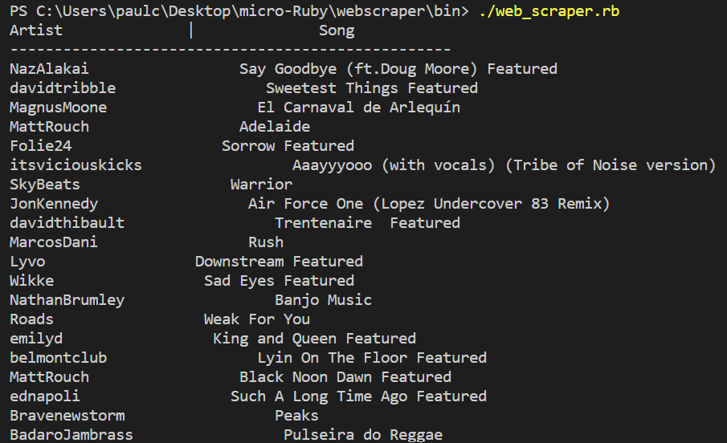
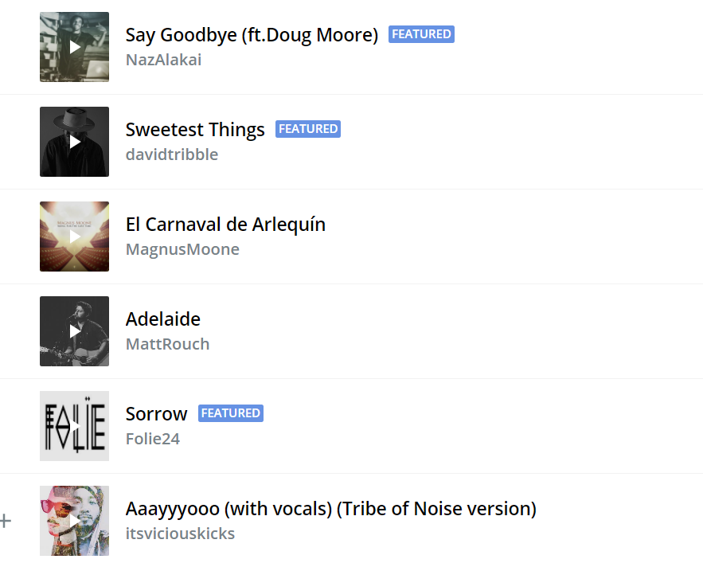

# "Ruby Web Scraper"
 This is an implementation of a web scraper. A web scraper gleans desired information from web pages. I used ruby for this implementaion. 

# This code includes the utilization of 
- ruby gem Nokogiri

## Built With
- Ruby

## Getting Started

- Open the terminal command line.
- Clone the repo:--> git clone https://github.com/Paul-Clue/webscraper.git
- PUll the branch: --> git pull https://github.com/Paul-Clue/webscraper.git feature/scrape
- run web_scraper.rb to scrape from a site that I have loaded in the file already.

## Instructions
- Make an instance of the Scraper class: `instance_variable = Scraper.new(url)`
- Enter a url of the site that you want to scrape as an arguement.
- Traverse the site's DOM tree using your web browser's inspect tool.
- Make a note of the tags/containers that hold the information you want to scrape.
- Use those tags/containers as arguements for the container function: `instance_variable.container(tags/containers)`
- Use the value from `instance_variable.container(tags/containers)` in a loop that returns the desired information you are seeking.

## ScreenShots
- The first screenshot is of what the scraper returns scraping the site.
- The second screenshot is of the site that was scraped.

## AUTHOR
👤 **Paul Clue**
- GitHub: [@Paul-Clue](https://github.com/Paul-Clue/) 
- LinkedIn: [Paul-Clue](https://www.linkedin.com/in/paul-clue-5136a01b1/)

## 🤝 Contributing

Contributions, issues, and feature requests are welcome!

## Show your support

Give a ⭐️ if you like this project!

## 📝 License

This project is [MIT](https://github.com/Paul-Clue/webscraper/blob/main/LICENSE) licensed.